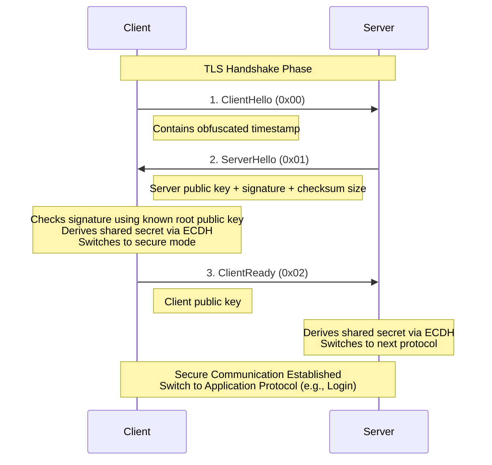
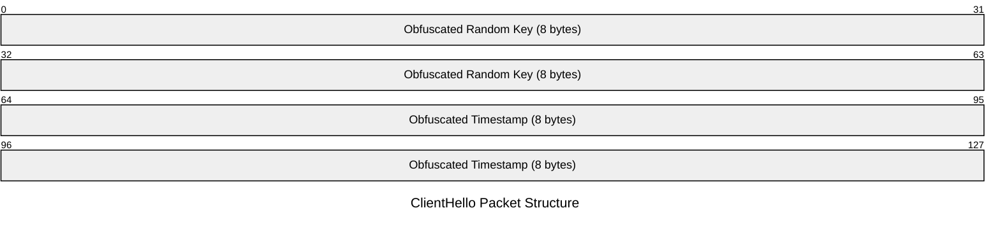
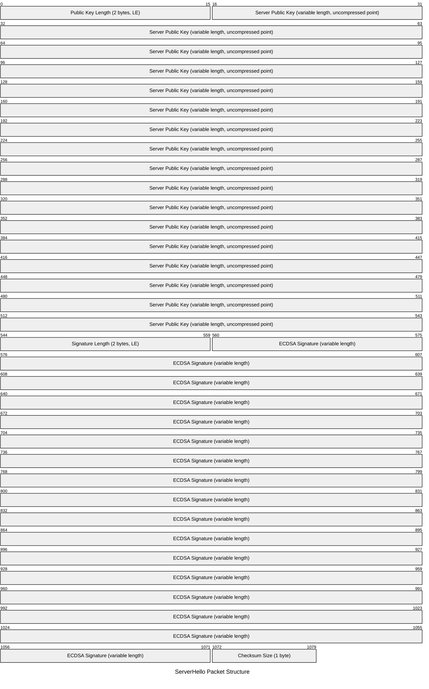
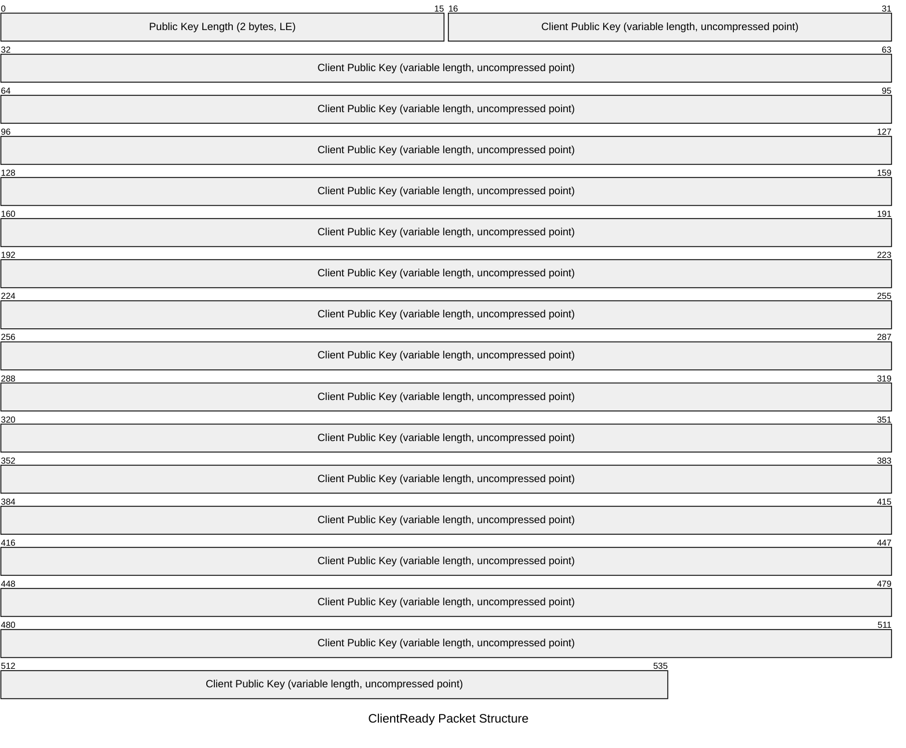
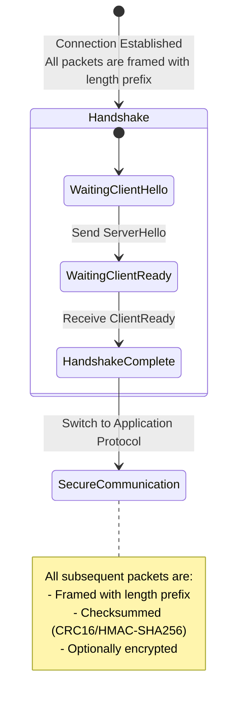

# OpenMMO TLS Protocol Specification

The OpenMMO TLS Protocol is a custom TLS-like implementation designed for secure communication between the PokeMMO client and server. This protocol establishes encrypted communication channels using ECDH key exchange.

## Protocol Flow

The TLS handshake follows a 3-packet exchange pattern:



## Packet Specifications

### 1. ClientHello Packet (Opcode: 0x00)

The ClientHello packet initiates the TLS handshake and contains an obfuscated timestamp for replay attack protection.



#### Field Details
- **Obfuscated Random Key**: Random value XOR'd with predefined key1 constant
- **Obfuscated Timestamp**: Client timestamp XOR'd with key2 and random key

#### Obfuscation Algorithm
```
randomKey = Random.nextLong()
xoredRandomKey = randomKey XOR key1
xoredTimestamp = timestamp XOR key2 XOR randomKey
```

### 2. ServerHello Packet (Opcode: 0x01)

The ServerHello packet contains the server's public key, authentication signature, and the checksum algorithm.



#### Field Details
- **Public Key Length**: Length of the public key data (typically 65 bytes)
- **Server Public Key**: ECDSA public key in uncompressed point format (0x04 + X + Y coordinates)
- **Signature Length**: Length of the ECDSA signature (typically 64 bytes)
- **ECDSA Signature**: Digital signature of the public key using server's root private key
- **Checksum Size**: Size of checksums to be used for subsequent packets (16 for HMAC-SHA256)

### 3. ClientReady Packet (Opcode: 0x02)

The ClientReady packet completes the handshake by providing the client's public key.



#### Field Details
- **Public Key Length**: Length of the client's public key data (typically 65 bytes)
- **Client Public Key**: Client's ECDSA public key in uncompressed point format

## Cryptographic Details

### Elliptic Curve Parameters
- **Curve**: secp256r1 (P-256)
- **Key Size**: 256-bit
- **Public Key Format**: Uncompressed point (65 bytes: 0x04 + 32-byte X + 32-byte Y)
- **Signature Algorithm**: ECDSA with SHA-256

### Uncompressed Point De/Encoding

```
// Constants
UNCOMPRESSED_POINT_INDICATOR = 0x04
CURVE = secp256r1 (P-256)
KEY_LENGTH = 32  // bytes for secp256r1

function encode_uncompressed_point(ecPublicKey):
  point = ecPublicKey.getPoint()
  x = point.getX().toByteArray()
  y = point.getY().toByteArray()
  
  // Create output buffer: 1 byte indicator + 32 bytes X + 32 bytes Y
  data = new ByteArray(1 + 2 * KEY_LENGTH)
  offset = 0

  // Set indicator
  data[offset++] = UNCOMPRESSED_POINT_INDICATOR

  // Handle X coordinate (pad or trim to 32 bytes)
  if x.length <= KEY_LENGTH:
      // Right-pad with zeros if too short
      copyBytes(x, 0, data, offset + KEY_LENGTH - x.length, x.length)
  else if x.length == KEY_LENGTH + 1 AND x[0] == 0:
      // Remove leading zero byte if present
      copyBytes(x, 1, data, offset, KEY_LENGTH)
  else:
      throw "X coordinate too large"

  offset += KEY_LENGTH

  // Handle Y coordinate (same logic as X)
  if y.length <= KEY_LENGTH:
      copyBytes(y, 0, data, offset + KEY_LENGTH - y.length, y.length)
  else if y.length == KEY_LENGTH + 1 AND y[0] == 0:
      copyBytes(y, 1, data, offset, KEY_LENGTH)
  else:
      throw "Y coordinate too large"

  return data

function decode_uncompressed_point(byteArray):
  // Validate format
  if byteArray[0] != UNCOMPRESSED_POINT_INDICATOR:
      throw "Invalid uncompressed point indicator"

  if byteArray.length != 1 + 2 * KEY_LENGTH:
      throw "Invalid data length"

  offset = 1

  // Extract X coordinate (32 bytes)
  x = bigIntegerFromBytes(byteArray[offset:offset + KEY_LENGTH])
  offset += KEY_LENGTH

  // Extract Y coordinate (32 bytes)
  y = bigIntegerFromBytes(byteArray[offset:offset + KEY_LENGTH])

  // Create EC point and public key
  point = ECPoint(x, y)
  return createECPublicKey(point, CURVE_SPEC)
```

### Key Derivation
After exchanging public keys, both client and server derive a shared secret using ECDH and generate symmetric encryption keys:

```
// ECDH Key Agreement
sharedSecret = ECDH(clientPrivateKey, serverPublicKey)  // On client side
sharedSecret = ECDH(serverPrivateKey, clientPublicKey)  // On server side

// Key Derivation Constants
CLIENT_KEY_SALT = "KeySalt" + 0x01
SERVER_KEY_SALT = "KeySalt" + 0x02
COMMON_IV_SALT = "IVDERIV"

function tripleHash(data, salt):
    hasher = SHA-256()
    hasher.update(salt)
    hasher.update(data)
    hasher.update(salt)
    digest = hasher.finalize()
    return digest[0:16]  // First 16 bytes for 128-bit AES key

// Derive Symmetric Keys (if shared secret >= 128 bits)
if sharedSecret.length * 8 >= 128:
    clientSeed = tripleHash(sharedSecret, CLIENT_KEY_SALT)
    serverSeed = tripleHash(sharedSecret, SERVER_KEY_SALT)
else:
    // Fallback to default seeds
    clientSeed = defaultClientSeed
    serverSeed = defaultServerSeed

// Create AES-CTR Ciphers
clientKey = AES_Key(clientSeed)
serverKey = AES_Key(serverSeed)
clientIV = tripleHash(clientSeed, COMMON_IV_SALT)
serverIV = tripleHash(serverSeed, COMMON_IV_SALT)

// Initialize Ciphers
encryptionCipher = AES-CTR(serverKey, serverIV)  // Server encrypts with server key
decryptionCipher = AES-CTR(clientKey, clientIV)  // Server decrypts with client key
```

#### Key Usage
- **Client Seed**: Used for client-to-server encryption (server decrypts with this)
- **Server Seed**: Used for server-to-client encryption (server encrypts with this)
- **AES-CTR Mode**: Stream cipher mode enabling encryption/decryption of arbitrary length data
- **IV Derivation**: Initialization vectors derived using the same triple-hash with common salt
## Protocol State Machine



## Implementation Notes

### Packet Framing
- All packets are prefixed with a length field
- No encryption or checksum is applied during the handshake phase

After the TLS handshake, all subsequent packets use the following format:
- Length prefix (variable encoding)
- Packet payload (encrypted if in secure mode)
- Checksum suffix (size determined by ServerHello)

### Error Handling
- Invalid signatures result in connection termination
- Malformed packets trigger protocol violations
- Timestamp validation failures indicate potential replay attacks